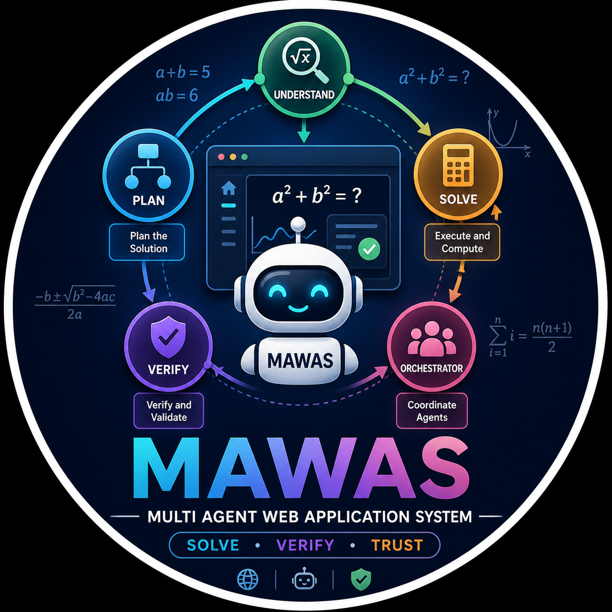

# Мультиагентная система для генерации и проверки математических задач

<p align="center">
  
</p>

# Описание проекта

Самостоятельное освоение математических дисциплин часто сопряжено с когнитивными затруднениями: отсутствие оперативной обратной связи и направляющего сопровождения, аналогичного репетиторскому, нередко приводит к поиску готовых решений в сторонних источниках вместо формирования устойчивого навыка в решении математических задач. Существующие мультиагентные подходы в этой области носят экспериментальный характер и ограничены рамками тестовых бенчмарков, не предлагая готовых программных решений, пригодных для интеграции в реальный образовательный процесс. В настоящей работе представлена архитектура и реализация мультиагентного веб-приложения MAWAS (Multi-Agent Web Application System), предназначенного для генерации, решения и верификации решений математических задач, введенных пользователем. Предложенный подход имитирует коллегиальную работу нескольких экспертов: один агент отвечает за создание условий задачи, другой — за поэтапное решение, третий — за критический анализ ответа пользователя с учетом типичных ошибок и критериев оценивания. Разработанное веб-приложение предоставляет интуитивно понятный интерфейс, позволяющий студентам использовать возможности мультиагентной системы на базе искусственного интеллекта для автономной подготовки и контроля знаний. Проведена апробация системы на задачах различного уровня сложности, подтверждена ее способность не только детектировать факт ошибки в решении, но и локализовать её с предоставлением обратной связи студенту.

> **Научный руководитель:** Артём Беляев (tg: @karaoke_tutu)

> **Студент:** Андрей Тимонин (tg: @sidtim)

# Порядок запуска web-приложения

1. Склонируйте репозиторий к себе на локальный компьтер.
2. В корне проекта создайте файл `.env`. В данный файл необходимо поместить ваш `API-KEY` и `BASE-URL` для доступа к LLM, которые вы можете получить на портале [VSELLM](https://vsellm.ru/). Помимо этого вы можете поместить в этот файл различные настройки конфигурации для LLM и номера соответствующих портов. Пример заполнения `.env`:

```bash
# API-KEY and BASE-URL
OPEN_API_KEY_VSE_LLM="..."
OPENAI_BASE_URL="..."

# MODEL CONFIG
MODEL_ID="deepseek/deepseek-v3.2"
TEMPERATURE="0.7"

# PORTS
BACKEND_PORT=8000
FRONTEND_PORT=8501
```

3. Для запуска web-приложения перейдите в директорию `ai_mas_hse_project` и выполните в bash-терминале команду: `TEMPERATURE=0.7 MAX_TOKENS=2048 MODEL_ID=deepseek/deepseek-v3.2 docker-compose up --build`. Параметры окружения `TEMPERATURE`, `MAX_TOKENS`, `MODEL_ID` можете задать свои. Чтобы проверить конфигурацию откройте новый bash-терминал и введите: `curl http://localhost:8000/config`

# Структура репозитория


```
ai-mas-hse-project
├──ai_mas_hse_project
│   ├──backend
│   │   ├──agents
│   │   │   ├──__init__.py
│   │   │   ├──generator.py
│   │   │   ├──mcp_solver.py
│   │   │   ├──reviewer.py
│   │   │   └──solver.py
│   │   ├──graph
│   │   │   └──workflow.py
│   │   ├──models
│   │   │   ├──__init__.py
│   │   │   └──schemas.py
│   │   ├──static_dataset
│   │   ├──config.py
│   │   ├──Dockerfile
│   │   ├──main.py
│   │   └──requirements.txt
│   ├──data
│   │   ├──final_dataset
│   │   │   ├──list_dict_with_tasks_update.pkl
│   │   │   └──list_dict_with_tasks.pkl
│   │   ├──html_source
│   │   ├──json_source
│   │   └──llm_results
│   │   │   └──tasks_result_liquidai_06_01_2025.pkl
│   ├──frontend
│   │   ├──static_dataset
│   │   ├──app.py
│   │   ├──Dockerfile
│   │   └──requirements.txt
│   ├──notebooks
│   │   ├──1-create-dataset.ipynb
│   │   ├──2-eda.ipynb
│   │   ├──3-agent-tutorial.ipynb
│   │   ├──4-agent-baseline.ipynb
│   │   ├──5-russian-math-dataset.ipynb
│   │   ├──6-openai-test.ipynb
│   │   ├──7-metrics.ipynb
│   │   ├──8-update-dataset.ipynb
│   │   ├──9-calc-metrics.ipynb
│   │   ├──config.py
│   │   ├──final_metrics_for_vkr.parquet
│   │   └──mcp_influence_for_vkr.parquet
│   ├──src
│   │   └──create_dataset.py
│   ├──static_dataset
│   │   ├──list_dict_with_tasks_update.pkl
│   │   ├──list_dict_with_tasks.pkl
│   │   └──mcp_equations.pkl
│   ├──__init__.py
│   ├──calculator_server.py
│   ├──docker-compose.yml
│   └──main.py
├──assets
│   └──mawas_preview.png
├──references
│   └──README.md
├──LICENSE
├──poetry.lock
├──pyproject.toml
├──README.md
├──tas_config.sh
├──.gitignore
└──.pre-commit-config.yaml
```